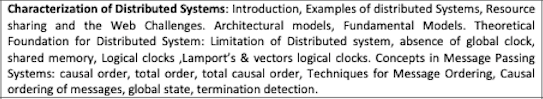

# Syllabus

# Video Lectures

[Lecture 1 - Syllabus & Marks](https://drive.google.com/file/d/1PMtqmEs4xqtvqJYQMdCyo4_x1-APH1N0/view?usp=sharing)

[Lecture 2 - Introduction to DS](https://drive.google.com/file/d/1Kj3N1GUtZO2VUQDqpnFdx4s4ZiIH0-DW/view?usp=sharing)

[Lecture 3 - Characteristics of DS](https://drive.google.com/file/d/1htg3JF2NGSwsFyIb0cyftMLnfeyZAKs_/view?usp=sharing)

[Lecture 4 - System models of DS](https://drive.google.com/file/d/1GCgYOcpcPHAMPGuYyKMDnL4VZl1wj6gc/view?usp=sharing)

[Lecture 5 - Key design goals of DS](https://drive.google.com/file/d/1AF77FmgS5MlyzlCxcegkffTDMu-0dfTy/view?usp=sharing)

[Lecture 6 - Limitations & Challenges of DS](https://drive.google.com/file/d/1ZBJ607iHByIaJEhRc1BZp7FVfx0wA3Kn/view?usp=sharing)

[Lecture 7 - Synchronization in DS](https://drive.google.com/file/d/1urrQoW2Dnk6WFKFXkIPlfLC6YEPweeIt/view?usp=sharing)

[Lecture 8 - Casual Ordering of messages](https://drive.google.com/file/d/108toc7RlVUxKsAaS3llaX1oBF5qnbsbY/view?usp=sharing)

[Lecture 9 - Birman Sciper Stephenson Protocol](https://drive.google.com/file/d/1PXk84ZrUCEA54Fcq9XHxgc9h54XYDGOK/view?usp=sharing)

[Lecture 10 - Lamport's Logical clock](https://drive.google.com/file/d/1PXk84ZrUCEA54Fcq9XHxgc9h54XYDGOK/view?usp=sharing)

[Lecture 11 - Vector Clock](https://drive.google.com/file/d/1PXk84ZrUCEA54Fcq9XHxgc9h54XYDGOK/view?usp=sharing)

[Lecture 12 - Logical clock in DS](https://drive.google.com/file/d/1PXk84ZrUCEA54Fcq9XHxgc9h54XYDGOK/view?usp=sharing)

[Lecture 13 - Global states in DS](https://drive.google.com/file/d/1PXk84ZrUCEA54Fcq9XHxgc9h54XYDGOK/view?usp=sharing)

[Lecture 14 - Chandy Lamport global state recording algo](https://drive.google.com/file/d/1PXk84ZrUCEA54Fcq9XHxgc9h54XYDGOK/view?usp=sharing)

[Lecture 15 - Termination detection](https://drive.google.com/file/d/1PXk84ZrUCEA54Fcq9XHxgc9h54XYDGOK/view?usp=sharing)
